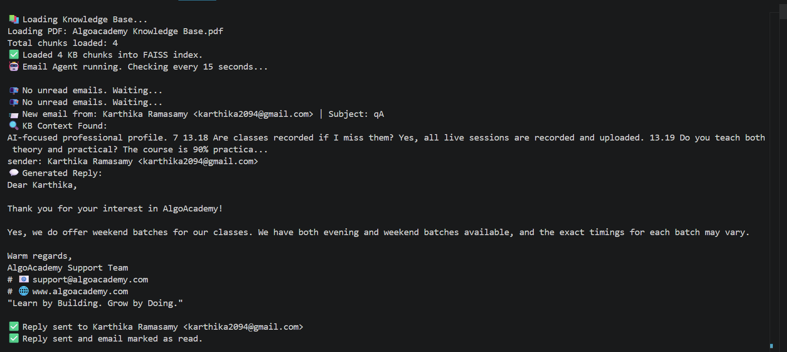
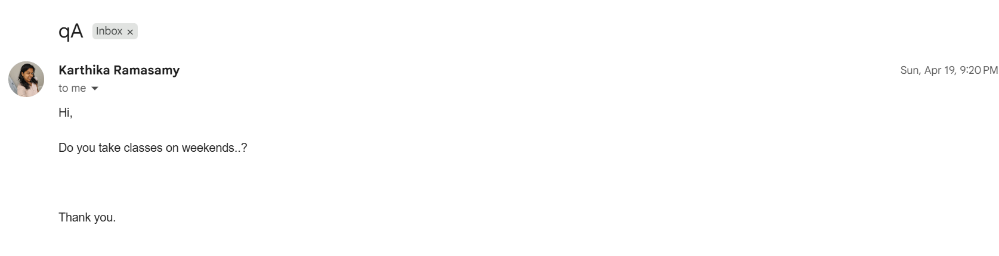

# 🤖 AI Email Auto-Reply Agent

An intelligent email automation system that reads incoming emails, searches a custom Knowledge Base using RAG (Retrieval Augmented Generation), generates contextual replies using Google Gemini AI, and sends them automatically — all without human intervention.

---
## 📸 Project Demo

### Agent Running in Terminal


### Email Received


### Auto Reply Sent

---

## 📌 Project Demo Flow
Incoming Email → Read via Gmail API → Search Knowledge Base (FAISS)
→ Generate Reply (Gemini AI) → Send Reply Automatically


---

## ✨ Features

- 📥 **Automatic Email Reading** — Monitors Gmail inbox every 15 seconds for new unread emails
- 🔍 **RAG-Powered Search** — Searches a custom PDF Knowledge Base using FAISS vector similarity
- 🤖 **AI-Generated Replies** — Generates professional, context-aware replies using Google Gemini
- 📤 **Auto Send** — Sends replies automatically and marks emails as read
- 👤 **Personalized Greetings** — Extracts sender's first name and personalizes every reply
- 🛡️ **Smart Email Filtering** — Skips automated/system emails (no-reply, alerts, notifications)
- 🔄 **Retry Logic** — Handles API quota limits gracefully with automatic retry
- 📄 **PDF Knowledge Base** — Supports PDF and TXT files as knowledge sources
- ✍️ **Professional Signature** — Every reply includes a consistent branded signature

---

## 🛠️ Tech Stack

| Technology | Purpose |
|---|---|
| Python 3.10+ | Core programming language |
| Gmail API (Google Cloud) | Read, send, and manage emails via OAuth 2.0 |
| Google Gemini AI (`gemini-2.5-flash`) | LLM for generating contextual email replies |
| FAISS (Facebook AI Similarity Search) | Vector database for fast KB similarity search |
| Sentence Transformers (`all-MiniLM-L6-v2`) | Converts text chunks into vector embeddings |
| PyMuPDF (`fitz`) | Extracts text from PDF knowledge base files |
| python-dotenv | Manages API keys and environment variables securely |

---

## 📁 Project Structure
Email_agent/
├── knowledge_base/
│ └── your_knowledge_base.pdf # Your custom KB document (PDF or TXT)
├── main.py # Main agent loop — orchestrates everything
├── gmail_handler.py # Gmail API: authenticate, read, send emails
├── rag_engine.py # RAG engine: PDF loading, chunking, FAISS search
├── credentials.json # Google OAuth credentials (do NOT share)
├── token.json # Auto-generated Gmail session token
├── .env # API keys (do NOT share)
├── requirements.txt # Python dependencies
└── README.md # Project documentation


---

## 🔑 APIs & Credentials Required

### 1. Gmail API — Google Cloud Console
- **Purpose:** Read unread emails, send replies, mark emails as read
- **Auth Method:** OAuth 2.0
- **How to get:**
  1. Go to [Google Cloud Console](https://console.cloud.google.com)
  2. Create a new project
  3. Enable **Gmail API** under APIs & Services → Library
  4. Configure **OAuth Consent Screen** (External) → Add yourself as Test User
  5. Create **OAuth Client ID** (Desktop App) → Download as `credentials.json`
- **Scopes used:**
- https://www.googleapis.com/auth/gmail.readonly
https://www.googleapis.com/auth/gmail.send
https://www.googleapis.com/auth/gmail.modify


### 2. Google Gemini API — Google AI Studio
- **Purpose:** Generate intelligent, context-aware email replies
- **Model used:** `gemini-2.5-flash`
- **How to get:**
1. Go to [Google AI Studio](https://aistudio.google.com/apikey)
2. Click **"Create API Key"** → Select or create a project
3. Copy the API key
- **Free Tier Limits:** 500 requests/day, 15 requests/minute

---

## ⚙️ Installation & Setup

### Step 1 — Clone the Repository
```bash
git clone https://github.com/your-username/email-agent.git
cd email-agent
```

### Step 2 — Create Virtual Environment
```bash
python -m venv venv
# Windows:
venv\Scripts\activate
# Mac/Linux:
source venv/bin/activate
```

### Step 3 — Install Dependencies
```bash
pip install -r requirements.txt
```

### Step 4 — Add Your Credentials
Place `credentials.json` (downloaded from Google Cloud) in the project root.

Create a `.env` file:
GEMINI_API_KEY=your_gemini_api_key_here


### Step 5 — Add Your Knowledge Base
Place your PDF or TXT file inside the `knowledge_base/` folder:
knowledge_base/
└── your_document.pdf


### Step 6 — Run the Agent
```bash
python main.py
```
- A browser window will open on the **first run** for Gmail OAuth login
- Log in with your Gmail account → Click **Allow**
- `token.json` is auto-generated and reused for future runs

---

## 🔄 How It Works
Agent starts → Loads PDF KB → Builds FAISS vector index

Every 15 seconds → Checks Gmail for unread emails

Filters out system/automated emails (no-reply, alerts)

For each real email:
a. Extracts sender name and email body
b. Searches FAISS index for top 3 relevant KB chunks
c. Sends KB context + email body to Gemini AI
d. Gemini generates a personalized, professional reply
e. Reply is sent via Gmail API
f. Email is marked as read (never processed twice)

Loop repeats every 15 seconds

---

## 📦 requirements.txt
google-auth-oauthlib
google-auth-httplib2
google-api-python-client
google-generativeai
sentence-transformers
faiss-cpu
python-dotenv
numpy
pymupdf

---

## 🔒 Security Notes

- **Never commit** `credentials.json`, `token.json`, or `.env` to GitHub
- Add these to `.gitignore`:
- credentials.json
token.json
.env

- `token.json` gives full Gmail access — keep it private
- If compromised, delete it and re-run `python main.py` to regenerate

---

## ⚠️ Known Limitations

| Limitation | Details |
|---|---|
| Free API quota | Gemini free tier: 500 req/day. Add billing to increase |
| Plain text replies only | HTML email formatting not implemented |
| English language only | KB and prompts optimized for English |
| Single Gmail account | Monitors one inbox at a time |

---

## 🚀 Future Improvements

- [ ] HTML formatted email replies
- [ ] Web dashboard to monitor reply logs
- [ ] Support for multiple Gmail accounts
- [ ] Automatic KB update from new documents
- [ ] Confidence score threshold before sending replies
- [ ] Multi-language support

---

## 👩‍💻 Author

**Karthika Ramasamy**
Built as part of AI/ML Development
